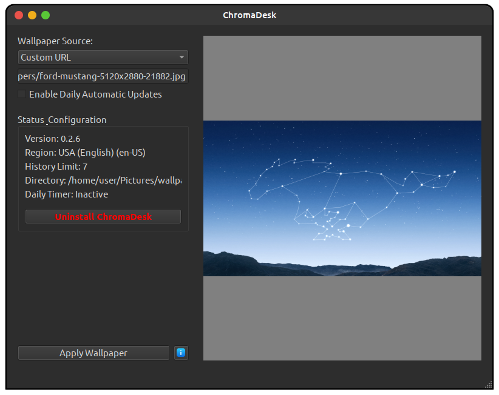
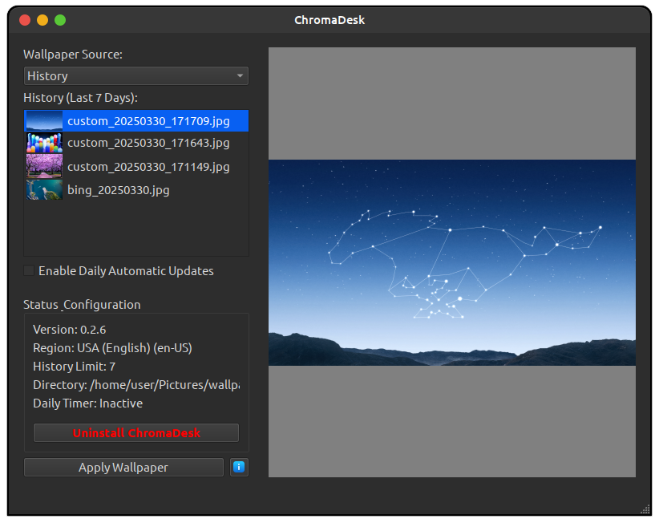
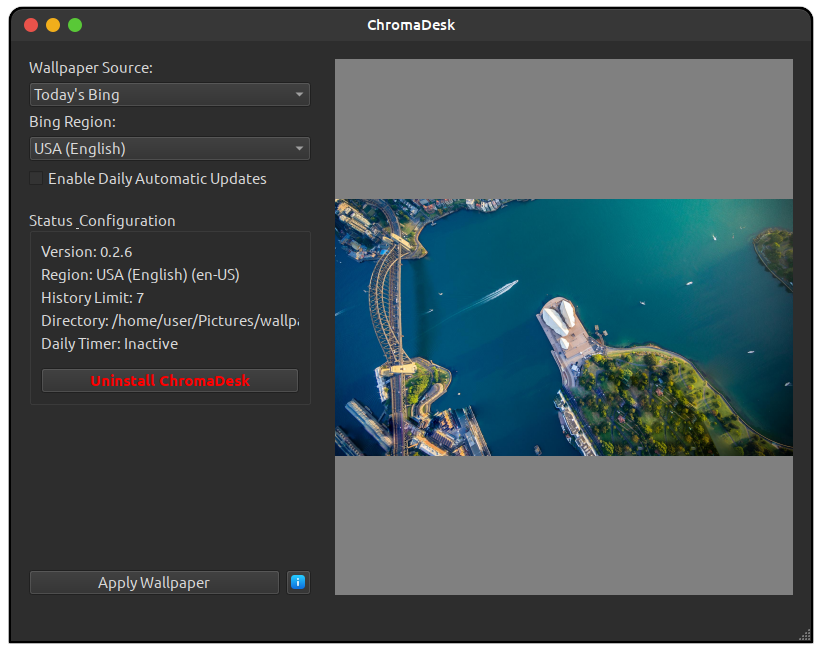

# ChromaDesk ✨

<p align="center">
  
</p>

A modern wallpaper management application for 🐧 Linux/GNOME desktop environments. ChromaDesk automatically fetches and applies beautiful images from Bing's daily wallpapers 🖼️ or your own custom sources.

## Features 🚀

-   **Daily Bing Wallpapers**: Automatically fetch and apply the Bing image of the day 📅
-   **Custom Image Sources**: Add your own URLs or local directories 📁
-   **Scheduling**: Configure automatic updates using systemd timers ⏱️
-   **History Management**: Browse and reapply previously downloaded wallpapers 💾
-   **Localization**: Set your preferred Bing region for region-specific images 🌍
-   **Modern UI**: Clean, intuitive Qt-based interface ✨
-   **Minimal Resource Usage**: Efficient background operation ⚙️
-   **AppImage Support**: Easy to run, no installation needed! 📦

## Screenshots 📸

| Bing Today                                     | History                                       | Custom Sources                                  |
| :---------------------------------------------: | :--------------------------------------------: | :----------------------------------------------: |
|             |               |          |

## Installation 💻
### Prerequisites
- [**FUSE**](https://github.com/appimage/appimagekit/wiki/fuse)


### Recommended Method: AppImage 🚀

The easiest way to get started with ChromaDesk is by using the official AppImage. This is a single file containing the application and all its dependencies, requiring no complex installation.

1.  Download the latest `chromadesk-*.AppImage` from the [**Releases Page**](https://github.com/anantdark/chromadesk/releases)  C
2.  Make the AppImage executable:
    ```bash
    chmod +x chromadesk-*.AppImage
    ```
3.  Run it! 🎉
    ```bash
    ./chromadesk-*.AppImage
    ```

#### Desktop Integration with AppImageLauncher (Highly Recommended! 👍)

For seamless integration with your desktop environment (application menus, icons, file associations), we *highly* recommend using [**AppImageLauncher**](https://github.com/TheAssassin/AppImageLauncher).

AppImageLauncher makes running and managing AppImages incredibly simple:

-   When you first run an AppImage, it asks if you want to integrate it into your system.
-   Choose "Yes" ✅, and it automatically moves the AppImage, adds it to your application menu, and sets up icons/associations.
-   Handles updates and removals cleanly. 🧼

Install AppImageLauncher, then just double-click the ChromaDesk AppImage!

### Alternative Methods 🤔

While the AppImage is recommended, other installation methods are available:

#### Option 2: Using pip (Python Package) 🐍

*Requires Python >= 3.8 and pip installed.*

```bash
# Install from PyPI (if published)
# pip install chromadesk

# Or install in development mode from source
git clone https://github.com/anantdark/chromadesk.git
cd chromadesk
pip install -e .
# Optional: Install notification support
# pip install -e ".[notifications]"
```

#### Option 3: Build from Source 🛠️

*Requires Python >= 3.8, pip, venv, and potentially build tools.*

```bash
# Clone the repository
git clone https://github.com/anantdark/chromadesk.git
cd chromadesk

# Create a virtual environment (recommended)
python -m venv .venv
source .venv/bin/activate

# Install dependencies
pip install -e .
# Optional: Install notification support
# pip install -e ".[notifications]"

# Run the application
python -m chromadesk
```

## Usage ▶️

### Running the AppImage 📦

-   If you integrated with AppImageLauncher, find ChromaDesk in your application menu. Easy! ✨
-   Otherwise, navigate to where you saved the `chromadesk-*.AppImage` file and run it from the terminal:
    ```bash
    ./chromadesk-*.AppImage
    ```

### Running from pip/source Installation 🐍

Launch ChromaDesk from your terminal:

```bash
chromadesk
```

### GUI Application 🖱️

Once launched, the main interface allows you to:

-   View and apply the current Bing wallpaper 🖼️
-   Browse your wallpaper history 💾
-   Configure automatic updates (scheduling) ⏱️
-   Set up custom image sources 📁
-   Manage application settings ⚙️

### Command-line Usage ⌨️

ChromaDesk also supports headless operation, primarily for the scheduled timer:

```bash
# Run the headless update (used by the timer service)
# (Replace with actual path if not installed/integrated)
~/.local/bin/io.github.anantdark.chromadesk --headless

# Get help on available options
# (Replace with actual path or python -m chromadesk.main --help if running from source)
./chromadesk-*.AppImage --help
```

## System Integration 🤝

ChromaDesk integrates with `systemd` for scheduled operations:

-   **Timer Service**: `chromadesk-daily.timer` - Controls when updates occur ⏱️
-   **Service Unit**: `chromadesk-daily.service` - Performs the actual update ⚙️

The application will install and configure these units automatically when you enable scheduled updates via the GUI.

## Building from Source 🛠️

The project includes a build script (`build.sh`) that simplifies the process of creating a standalone executable or AppImage:

```bash
# Make the build script executable (if not already)
chmod +x build.sh

# Run the build script (builds executable)
./build.sh

# Build an AppImage (Recommended for distribution!)
./build.sh --appimage

# Get help on available options
./build.sh --help
```

The script handles:

1.  Virtual environment setup ✅
2.  Dependency installation ✅
3.  Building with PyInstaller ✅
4.  AppImage creation (optional) ✅
5.  Desktop integration setup within the AppImage ✅

Built artifacts are placed in the `dist/` directory.

### Build Script Options

Available options for `./build.sh`:

-   `--help` or `-h`: Show help information ❓
-   `--version-update VER`: Update version numbers to `VER` 🏷️
-   `--build-only`: Update version numbers without building 🚫
-   `--appimage`: Create an AppImage after building the executable 📦

### Updating the Version

```bash
# Update to 0.2.0 and build AppImage
./build.sh --version-update 0.2.0 --appimage
```

This updates the version in `chromadesk/__init__.py` and `pyproject.toml`.

## Testing 🧪

ChromaDesk includes a test suite:

```bash
# Run all tests
python -m unittest discover tests

# Run a specific test file
python -m unittest tests.test_basics
```

## Troubleshooting ❓

### Mesa Intel Graphics Warning ⚠️

If you see `MESA-INTEL: warning: Performance support disabled...`, this is usually harmless.

You can:

1.  **Ignore it** 🙂
2.  **Suppress it temporarily**: `MESA_DEBUG=silent ./chromadesk-*.AppImage`
3.  **Fix it permanently** (if you have admin rights):
    ```bash
    sudo sysctl dev.i915.perf_stream_paranoid=0
    # And add dev.i915.perf_stream_paranoid=0 to /etc/sysctl.conf
    ```

## Requirements 📋

-   Python 3.8+ 🐍
-   PySide6 (Qt for Python) 🎨
-   Requests 🌐
-   Pillow 🖼️
-   GNOME desktop environment (for wallpaper setting) 🖥️
-   Optional for notifications: `notify2`, `dbus-python` 🔔

## Contributing 🤝

Contributions are welcome! Please feel free to submit a Pull Request.

See [CONTRIBUTING.md](CONTRIBUTING.md) for detailed guidelines. 🙏

## License 📜

This project is licensed under the GPL-3.0 License - see the LICENSE file for details.

## Author 🧑‍💻

Anant Patel - [GitHub](https://github.com/anantdark)
